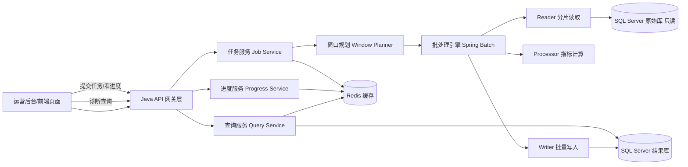
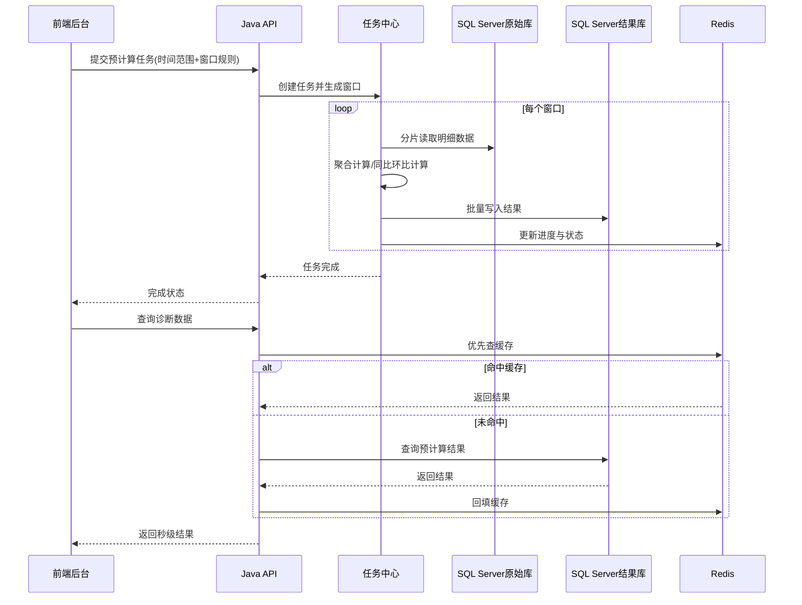

# 品类诊断 Java 后端改写详细方案（高性能离线预计算版）

## 0. 项目全景逻辑与项目图

## 0.1 一句话说明项目逻辑

系统核心逻辑是：  
**从 SQL Server 批量读取历史数据 -> 按时间窗口离线预计算 -> 结果写入结果库/缓存 -> 前端页面按筛选条件秒级读取结果，不做在线大计算。**

## 0.2 项目整体业务闭环（端到端）

```text
[运营/分析人员]
   -> 后台配置时间范围、门店范围、品类范围
   -> 提交预计算任务

[任务中心]
   -> 生成窗口计划（月/双月/半年/年度/同比/环比/自定义）
   -> 分片并行读取 SQL Server 原始事实数据
   -> 聚合计算指标与对比结果
   -> 批量写入结果库 + 刷新 Redis 缓存
   -> 持续上报任务进度/状态/日志

[业务页面]
   -> 品类树/全类检测/品类诊断发起查询
   -> 优先命中 Redis，未命中查结果库
   -> 返回诊断结果与趋势/清单/图表数据
```

## 0.3 项目组件关系图（架构图）



## 0.4 关键时序图（预计算 + 查询）



---

## 1. 目标与边界

本方案只解决 Java 后端重构，不展开前端改造和数据库字段明细设计。核心目标是：

- 数据源为 SQL Server，支持亿级到百亿级历史数据读取
- 采用离线预计算，不做在线临时大计算
- 用户进入诊断页时直接读取结果，接口稳定秒级返回
- 支持按配置读取时间范围（如两年前到当前）
- 支持单月、双月、半年、年度、同比、环比、自定义对比窗口
- 后台可手动提交任务并实时查看进度

非目标：

- 不在本次文档中写具体业务字段清单
- 不在本次文档中扩展前端页面设计细节

---

## 2. 技术选型（性能优先）

## 2.1 后端框架

- Java 21
- Spring Boot 3.3.x
- Spring Web + Spring Validation
- Spring Batch（大批量离线任务核心）
- MyBatis（复杂 SQL 可控，便于 SQL Server 优化）
- Redisson + Redis（进度、锁、热点缓存）
- Micrometer + Prometheus + Grafana（监控）
- Logback + JSON 日志（可对接 ELK）

说明：  
高吞吐离线计算场景下，Spring Batch + MyBatis 的可控性和落地效率最好，避免纯 ORM 在超大数据量下的不可控 SQL。

## 2.2 SQL Server 连接与读取策略

- 驱动：Microsoft JDBC Driver for SQL Server（官方）
- 连接池：HikariCP
- 读取方式：按时间窗口 + 主键范围双维度分片并行读取
- 批量参数：
  - `fetchSize` 按压测调优（建议 2000~10000）
  - 单批提交行数（chunk）建议 2000~5000
  - 单任务并发分片建议 8~32（按机器和库负载动态调）
- 只读连接、低锁策略、必要时读取副本（只读库）

## 2.3 缓存与任务协同

- Redis 用途：
  - 任务进度实时状态（百分比、阶段、吞吐、预计剩余）
  - 分布式锁（防止重复跑同一窗口任务）
  - 热点诊断结果缓存（TTL + 主动失效）
  - 幂等键与去重控制
- Key 规范按模块前缀统一，例如：
  - `diag:job:progress:{jobId}`
  - `diag:result:query:{hash}`
  - `diag:lock:window:{bizKey}`

---

## 3. 总体架构

```text
[管理后台]
   -> 提交预计算任务
[Java API网关层]
   -> 任务管理服务(Job Service)
   -> 查询服务(Query Service)
   -> 进度服务(Progress Service)

[调度与批处理]
   -> Spring Batch Job
   -> 分片读取 Reader
   -> 聚合计算 Processor
   -> 批量写入 Writer

[存储]
   -> SQL Server 原始业务库（只读）
   -> SQL Server 结果库（诊断结果）
   -> Redis（进度/缓存/锁）
```

设计原则：

- 原始事实数据与结果数据隔离
- 任务计算与在线查询隔离
- 可重复跑、可回放、可中断续跑
- 任何重计算都不影响在线接口 SLA

---

## 4. 离线预计算模型（核心）

## 4.1 计算分层

- L1：基础周期汇总层（按月、双月、半年、年）
- L2：对比层（同比、环比、自定义窗口）
- L3：诊断结果层（页面直接消费）

在线查询只读 L3，必要时回落 L2，不触达原始明细大表。

## 4.2 时间窗口生成策略

任务提交后先生成窗口清单（Window Plan），例如：

- 单月：`[2024-01] [2024-02] ...`
- 相邻月：`[2024-02 vs 2024-01] [2024-03 vs 2024-02] ...`
- 双月：`[2024-01~02 vs 2024-03~04]`
- 半年：`[2024H2 vs 2024H1]`
- 年度：`[2025 vs 2024]`
- 自定义：`[A_start~A_end vs B_start~B_end]`

窗口生成器要求：

- 支持“从两年前开始”的动态起止
- 支持后台参数化配置，非硬编码
- 支持幂等（同窗口重复触发不重复计算或可覆盖重算）

## 4.3 计算执行链路

1. 创建 Job 实例，记录任务元数据  
2. 生成待计算窗口列表  
3. 按窗口并发读取 SQL Server 原始数据  
4. 在 Batch Processor 做聚合和指标计算  
5. 结果批量 upsert 到结果库  
6. 写入任务进度、吞吐、阶段日志到 Redis + DB  
7. 全部窗口完成后标记完成并刷新查询缓存

## 4.4 结果存储建议

- 结果表按统计周期分区（按月或按自然时间分区）
- 关键查询条件建立覆盖索引
- 高并发查询热点结果放 Redis，TTL 5~30 分钟
- 对“整年、半年”大窗口结果可做二级固化，避免重复拼装

---

## 5. 性能优化策略（亿级/百亿级）

## 5.1 读取侧（SQL Server）

- 只拉取计算必需列，禁止 `select *`
- 时间范围 + 主键区间组合过滤，避免大范围扫描
- 利用 SQL Server 分区表/分区索引（若现网已具备）
- 分片并行读取，单分片流式处理，避免内存全量加载
- 统一限流，保护生产库（令牌桶/并发阈值）

## 5.2 计算侧（Java）

- 批处理 chunk 化，禁止一次性加载全窗口
- 使用原生类型和对象复用减少 GC 压力
- CPU 密集和 IO 密集线程池隔离
- 指标计算尽量向下推（可在 SQL 层先做部分预聚合）

## 5.3 写入侧（结果库）

- 批量写入（batch upsert）
- 大任务按窗口分批提交事务，避免超长事务
- 同一窗口写入串行化，避免行级冲突
- 写后异步刷新缓存，降低写路径尾延迟

## 5.4 查询侧（诊断接口）

- 查询结果优先 Redis，其次结果表
- API 层增加参数校验和窗口命中校验
- 缓存穿透保护（空结果短 TTL）
- 对超大分页场景使用游标/seek，不用深分页

---

## 6. 后端接口设计（完整）

以下接口均为 Java 后端实现范围，路径可统一前缀 `/api/v1/diagnosis`.

## 6.1 任务管理接口

1) 提交预计算任务  
- `POST /jobs`
- 用途：后台点击“开始跑数据”
- 入参：
  - `jobName`
  - `readRange`（如 `TWO_YEARS` 或自定义 start/end）
  - `calcScopes`（MONTH, BIMONTH, HALF_YEAR, YEAR, MOM, YOY, CUSTOM）
  - `compareConfigs`（可选自定义窗口规则）
  - `forceRebuild`（是否强制重算）
  - `priority`
- 出参：`jobId`, `status`, `submittedAt`

2) 停止任务  
- `POST /jobs/{jobId}/stop`
- 用途：人工终止长任务

3) 重试失败任务  
- `POST /jobs/{jobId}/retry`

4) 任务列表  
- `GET /jobs`
- 支持按状态/时间/创建人筛选

5) 任务详情  
- `GET /jobs/{jobId}`
- 返回总体进度、阶段状态、吞吐、预计剩余

## 6.2 进度与日志接口

6) 实时进度  
- `GET /jobs/{jobId}/progress`
- 返回：
  - `percent`
  - `currentStage`（READING/PROCESSING/WRITING/FINALIZING）
  - `windowDone/totalWindow`
  - `rowsRead`, `rowsWritten`, `qps`
  - `etaSeconds`

7) 任务日志流  
- `GET /jobs/{jobId}/events`（SSE）
- 用途：后台页面实时滚动日志和阶段变化

8) 任务窗口明细  
- `GET /jobs/{jobId}/windows`
- 返回每个窗口的状态（PENDING/RUNNING/SUCCESS/FAILED）

## 6.3 配置接口（时间段与规则）

9) 创建计算模板  
- `POST /calc-templates`
- 定义读取范围、窗口规则、对比规则

10) 查询计算模板  
- `GET /calc-templates/{templateId}`

11) 启用模板并触发任务  
- `POST /calc-templates/{templateId}/run`

12) 时间窗口预览  
- `POST /windows/preview`
- 输入起止时间和规则，返回将生成的窗口清单（用于提交前确认）

## 6.4 诊断查询接口（读预计算结果）

13) 诊断总览  
- `GET /reports/overview`

14) 周期对比结果  
- `GET /reports/compare`
- 支持 month/bimonth/half-year/year/yoy/mom/custom 参数

15) 分类明细列表  
- `GET /reports/categories`

16) 导出结果  
- `POST /reports/export`

查询接口统一要求：

- 只读预计算结果
- 未命中结果时明确返回“数据准备中”，不触发在线重算

---

## 7. 核心实现骨架（Java）

## 7.1 模块拆分

- `diagnosis-api`：Controller + DTO + 参数校验
- `diagnosis-job`：任务编排、窗口生成、调度
- `diagnosis-batch`：Reader/Processor/Writer
- `diagnosis-repo`：MyBatis Mapper
- `diagnosis-cache`：Redis 进度和缓存
- `diagnosis-monitor`：指标和告警

## 7.2 关键类职责

- `JobCommandService`：接收提交/停止/重试命令
- `WindowPlanService`：生成单月/双月/半年/年度/自定义窗口
- `BatchOrchestrator`：按窗口并发调度批处理
- `ProgressReporter`：实时上报 Redis + DB
- `ResultQueryService`：读取缓存和结果库

## 7.3 幂等与一致性

- 任务提交幂等键：`jobName + timeRange + calcScopes + version`
- 窗口级幂等：同窗口重复执行只保留最新版本
- 结果写入采用版本号或批次号，保证查询一致性

---

## 8. 任务状态机

状态流转：

- `PENDING -> RUNNING -> SUCCESS`
- `PENDING -> RUNNING -> FAILED`
- `RUNNING -> STOPPED`
- `FAILED -> RETRYING -> RUNNING`

阶段流转：

- `INIT -> PLAN_WINDOW -> READ -> COMPUTE -> WRITE -> FINALIZE`

每个阶段均记录开始/结束时间、耗时、处理量、错误摘要。

---

## 9. 五周落地计划（按你要求）

## 第 1 周：工程骨架与可运行基线

- 建立 Java 21 + Spring Boot 工程结构
- 接入 SQL Server（HikariCP）与 Redis
- 完成任务管理基础接口（提交/列表/详情）
- 打通最小链路：提交任务 -> 执行空跑 -> 返回进度
- 输出压测基线脚本（小样本）

交付标准：任务全流程可跑通，后台可看到进度变化。

## 第 2 周：离线读取与窗口生成

- 实现时间范围配置（默认两年前到当前）
- 实现窗口生成器（单月、相邻月、双月、半年、年度、自定义）
- 实现分片 Reader（按时间+主键）
- 引入任务分布式锁和幂等控制

交付标准：可生成全量窗口并稳定读取原始数据。

## 第 3 周：核心预计算与批量写入

- 实现 Processor 指标聚合链路
- 实现 Writer 批量 upsert
- 完成窗口级状态管理与失败重试
- 完成阶段日志和错误归因

交付标准：可对指定范围完成全量预计算并落结果库。

## 第 4 周：查询接口与性能优化

- 完成诊断查询接口（overview/compare/categories/export）
- 接入 Redis 热点缓存与失效策略
- SQL 与索引优化、并发参数调优
- 压测并修正慢查询和长尾延迟

交付标准：常用查询秒级，任务吞吐达到目标阈值。

## 第 5 周：稳定性与上线准备

- 完成监控大盘（任务成功率、吞吐、延迟、失败率）
- 告警策略（任务失败、延迟异常、积压）
- 灰度上线与回滚预案
- 生产运行手册（重跑、停跑、故障处理）

交付标准：具备生产可运维能力，支持持续稳定跑批。

---

## 10. 运行与运维要求

- 每日定时增量任务 + 手工全量重算入口
- 所有任务支持审计（谁触发、跑了什么窗口、结果版本）
- 严格区分生产读库压力窗口，必要时夜间批量计算
- 保留最近 N 次任务明细，便于复盘

---

## 11. 验收标准

- 用户点击诊断接口不触发大计算，直接返回预计算结果
- 支持从两年前读取并完成全窗口预计算
- 支持单月/双月/半年/年度/同比/环比/自定义对比
- 后台可实时查看任务进度与日志
- 在目标数据量下，任务和查询均满足性能指标

---

## 12. 后续实施说明

当前文档为可直接进入开发的蓝图。实际编码时建议先落地最小闭环：

- 任务提交
- 窗口生成
- 单月预计算
- 结果查询
- 进度可视化

闭环稳定后再扩展到双月、半年、年度和自定义窗口，避免一次性铺太大导致调试周期过长。

---

## 13. 三大模块接口全清单（现状 + 目标 + 缺口）

本节按你当前项目页面拆分：

- 品类树（`CategoryTree`）
- 全类检测（`FullCategoryCheck`）
- 品类诊断（`DiagnosisInput` + `DiagnosisReport` + 深度分析）

接口说明格式统一为：

- 接口用途
- 请求方式与路径
- 请求参数（必填/可选）
- 返回核心字段
- 页面触发时机
- 性能策略（缓存/预计算/限流）

---

## 14. 品类树模块接口（细化）

## 14.1 现有接口（当前项目已存在）

1) 获取筛选项  
- `GET /api/categories/filter-options`
- 用途：加载“品类级别/品类编码/角色”下拉框
- 关键返回：`categoryLevels`, `categories`, `categoryRoles`
- 触发时机：进入品类树页首次加载
- 性能：内存短缓存（当前已有）

2) 获取品类树（支持筛选）  
- `GET /api/categories/tree`
- 查询参数：
  - `categoryLevel`（all/level1/level2/level3/level4）
  - `category`（品类编码）
  - `categoryRole`（STAR/NURTURE/CASH_COW/STRUCTURAL）
- 关键返回：树节点数组，含 `code/name/skuCount/suggestSku/children`
- 触发时机：筛选条件变更后刷新树
- 性能：内存缓存 + DB 持久缓存（当前已有基础）

3) 获取树缓存状态  
- `GET /api/categories/tree/cache-status`（需要认证）
- 用途：后台查看缓存是否存在、更新时间、节点规模

4) 重建树缓存  
- `POST /api/categories/tree/rebuild-cache`（需要认证）
- 用途：导入新数据后手工触发重建

5) 层级级联接口  
- `GET /api/categories/level1`
- `GET /api/categories/level2/{level1Code}`
- `GET /api/categories/level3/{level2Code}`
- `GET /api/categories/level4/{level3Code}`
- 用途：级联选择器与辅助筛选

6) 路径定位接口  
- `GET /api/categories/path/{level1Code}/{level2Code?}/{level3Code?}/{level4Code?}`

7) 品类关键词接口  
- `POST /api/categories/keywords`
- 用途：根据品类路径提取关键词，支持后续过滤

## 14.2 目标接口（Java 重构后建议标准）

1) 品类树查询（统一查询）  
- `GET /api/v1/category-tree/nodes`
- 参数：
  - `depth`（0-4）
  - `categoryCode`
  - `role`
  - `includeStats`（是否附带汇总统计）
- 返回：
  - `nodes`
  - `totalNodes`
  - `cacheHit`
  - `version`

2) 品类树筛选项  
- `GET /api/v1/category-tree/filter-options`
- 返回附带 `optionsVersion`，便于前端本地缓存

3) 品类树缓存状态  
- `GET /api/v1/category-tree/cache/status`

4) 品类树缓存重建任务  
- `POST /api/v1/category-tree/cache/rebuild`
- 返回：`jobId`

5) 品类树重建任务进度  
- `GET /api/v1/category-tree/cache/jobs/{jobId}`
- 返回：`status/progress/currentStage/etaSeconds`

## 14.3 缺口补齐（当前到目标）

- 当前重建是同步接口，建议改为异步任务（避免请求超时）
- 当前查询缓存粒度偏粗，建议增加版本号和命中标识
- 缺少“重建任务进度接口”
- 缺少“筛选项版本号”，前端无法安全做本地缓存

---

## 15. 全类检测模块接口（细化）

## 15.1 现有接口（当前项目已存在）

1) 获取全类检测汇总  
- `GET /api/analysis/full-check/summary`（需要认证）
- 参数：
  - `storeScope`
  - `categoryLevel`
  - `categoryCodes`
  - `periodStart/periodEnd`
  - `compareStart/compareEnd`
- 返回核心：
  - `topInfo`（本期/对比期信息）
  - `rolePoints`（四象限点位）
  - `warningCounts`（预警计数）
- 触发时机：页面初次加载 + 筛选变化

2) 全类检测缓存状态  
- `GET /api/analysis/full-check/cache-status`

3) 重建全类检测缓存  
- `POST /api/analysis/full-check/rebuild-cache`

4) 模拟数据生成（同步）  
- `POST /api/analysis/full-check/simulation-data/generate`

5) 模拟数据生成（异步启动）  
- `POST /api/analysis/full-check/simulation-data/generate/start`

6) 模拟数据清理（同步）  
- `DELETE /api/analysis/full-check/simulation-data`

7) 模拟数据清理（异步启动）  
- `POST /api/analysis/full-check/simulation-data/clear/start`

8) 模拟任务进度  
- `GET /api/analysis/full-check/simulation-data/jobs/{jobId}`

## 15.2 目标接口（Java 重构后建议标准）

1) 全类检测汇总查询（只读预计算）  
- `GET /api/v1/full-check/summary`
- 参数统一：
  - `storeScope`
  - `categoryLevel`
  - `categoryCodes`
  - `periodType`（month/bimonth/halfyear/year/custom）
  - `periodStart/periodEnd`
  - `compareMode`（mom/yoy/custom/none）
  - `compareStart/compareEnd`
- 返回：
  - `overview`
  - `roleScatter`
  - `warnings`
  - `dataVersion`
  - `cacheHit`

2) 全类检测明细分页  
- `GET /api/v1/full-check/details`
- 用途：点击点位后下钻列表
- 参数：分页 + 排序 + 预警类型筛选

3) 全类检测导出  
- `POST /api/v1/full-check/export`
- 支持按当前筛选导出，不重新计算

4) 全类检测缓存状态  
- `GET /api/v1/full-check/cache/status`

5) 全类检测缓存重算任务  
- `POST /api/v1/full-check/cache/rebuild`
- 返回 `jobId`

6) 全类检测任务进度  
- `GET /api/v1/full-check/cache/jobs/{jobId}`

## 15.3 缺口补齐（当前到目标）

- 当前 `summary` 口径参数较散，建议统一成 `periodType + compareMode`
- 当前缺少“明细分页下钻”标准接口（建议独立出来）
- 当前缺少“导出接口”（全类检测维度）
- 当前重建逻辑与模拟数据逻辑耦合，建议拆分业务任务与测试任务

---

## 16. 品类诊断模块接口（细化）

品类诊断是最大模块，分 4 组：

- A. 诊断主流程
- B. 日期与对比窗口
- C. 深度分析与钻取
- D. 导入与配置管理

## 16.1 A 组：诊断主流程接口

### 现有接口

1) 上传并分析  
- `POST /api/analysis/upload`
- 用途：历史上传式诊断入口（旧链路）

2) 数据库诊断  
- `POST /api/analysis/diagnose`
- 入参：
  - `category`
  - `storeScope`
  - `period`
  - `comparePeriod`
- 返回：诊断结果大包

3) 个人护理专用诊断  
- `POST /api/analysis/diagnose-personal-care`

### 目标接口

1) 诊断概览（主卡片）  
- `GET /api/v1/diagnosis/overview`
- 参数：
  - `categoryCode`
  - `storeScope`
  - `periodType/periodStart/periodEnd`
  - `compareMode/compareStart/compareEnd`
- 返回：
  - 核心经营指标
  - 对比指标
  - 诊断结论摘要
  - `dataVersion/cacheHit`

2) 诊断趋势  
- `GET /api/v1/diagnosis/trends`

3) 诊断角色分布  
- `GET /api/v1/diagnosis/role-distribution`

4) 诊断结论明细  
- `GET /api/v1/diagnosis/insights`

### 缺口补齐

- 当前 `diagnose` 返回包过大，建议拆为多接口并行请求
- 当前缺少 `dataVersion` 字段，不利于前端缓存一致性
- 当前缺少“只读预计算命中状态”字段

## 16.2 B 组：日期与对比窗口接口

### 现有接口

1) 可用日期  
- `POST /api/analysis/available-dates`

### 目标接口

1) 可用时间范围  
- `GET /api/v1/diagnosis/date-ranges`
- 返回：可选最小/最大日期，支持按门店和品类过滤

2) 对比窗口建议  
- `POST /api/v1/diagnosis/compare-windows/suggest`
- 输入：本期窗口 + 模式（同比/环比/自定义）
- 返回：推荐对比窗口列表

3) 窗口合法性校验  
- `POST /api/v1/diagnosis/compare-windows/validate`
- 返回：是否合法、是否有预计算结果、命中版本

### 缺口补齐

- 当前仅有“日期列表”，缺“窗口建议/校验”能力
- 当前页面端做过多日期推导，建议下沉到后端统一

## 16.3 C 组：深度分析与钻取接口

### 现有接口（已较多）

1) ABC 矩阵钻取  
- `POST /api/analysis/abc-matrix-products`

2) 毛利贡献散点  
- `GET /api/analysis/personal-care/profit-contrib-scatter`

3) 毛利贡献清单 + 筛选 + 导出  
- `GET /api/analysis/personal-care/profit-contrib-list`
- `GET /api/analysis/personal-care/profit-contrib-list/filters`
- `GET /api/analysis/personal-care/profit-contrib-list/export`

4) GMROI 清单 + 筛选 + 导出  
- `GET /api/analysis/personal-care/gmroi-product-list`
- `GET /api/analysis/personal-care/gmroi-product-list/filters`
- `GET /api/analysis/personal-care/gmroi-product-list/export`

5) 规格清单 + 筛选 + 导出  
- `GET /api/analysis/personal-care/specification-list`
- `GET /api/analysis/personal-care/specification-list/filters`
- `GET /api/analysis/personal-care/specification-list/export`

6) 品牌清单 + 筛选 + 导出  
- `GET /api/analysis/personal-care/brand-list`
- `GET /api/analysis/personal-care/brand-list/filters`
- `GET /api/analysis/personal-care/brand-list/export`

7) 价格带分析 + 商品清单 + 导出  
- `GET /api/analysis/personal-care/price-band`
- `GET /api/analysis/personal-care/price-band/product-list`
- `GET /api/analysis/personal-care/price-band/export-source`

### 目标接口（统一命名与可扩展）

建议统一为 `diagnosis/drilldown/*`，例如：

- `GET /api/v1/diagnosis/drilldown/abc-products`
- `GET /api/v1/diagnosis/drilldown/profit-contrib/scatter`
- `GET /api/v1/diagnosis/drilldown/profit-contrib/list`
- `GET /api/v1/diagnosis/drilldown/gmroi/list`
- `GET /api/v1/diagnosis/drilldown/spec/list`
- `GET /api/v1/diagnosis/drilldown/brand/list`
- `GET /api/v1/diagnosis/drilldown/price-band/summary`
- `GET /api/v1/diagnosis/drilldown/price-band/products`
- `POST /api/v1/diagnosis/drilldown/export`

统一参数约束：

- 全部支持 `page/pageSize/sortField/sortOrder`
- 全部支持 `period + comparePeriod`
- 全部返回 `total`、`dataVersion`、`cacheHit`

### 缺口补齐

- 现有接口命名偏业务专项（personal-care），难扩展到其他大类
- 缺少统一分页/排序协议
- 导出接口分散，建议统一导出网关

## 16.4 D 组：导入与配置管理接口

### 现有接口

1) 品类导入  
- `POST /api/analysis/category-import`
- `GET /api/analysis/category-imports`
- `GET /api/analysis/category-imports/{id}`
- `POST /api/analysis/category-imports/{id}/enable`
- `DELETE /api/analysis/category-imports/{id}`

2) 品类数据导入  
- `POST /api/analysis/data-import`
- `GET /api/analysis/data-imports`
- `GET /api/analysis/data-imports/{id}`
- `POST /api/analysis/data-imports/{id}/enable`
- `DELETE /api/analysis/data-imports/{id}`

3) 标签导入  
- `POST /api/analysis/tag-excel-upload-analysis`
- `GET /api/analysis/tag-imports`
- `POST /api/analysis/tag-imports/{id}/enable`
- `DELETE /api/analysis/tag-imports/{id}`

4) 状态接口  
- `GET /api/analysis/import-status`
- `GET /api/analysis/data-import-status`

5) 品类角色预设  
- `GET /api/analysis/category-role-overrides`
- `PUT /api/analysis/category-role-overrides`

### 目标接口（任务化）

- `POST /api/v1/imports/category/jobs`
- `POST /api/v1/imports/data/jobs`
- `POST /api/v1/imports/tag/jobs`
- `GET /api/v1/imports/jobs/{jobId}`
- `GET /api/v1/imports/jobs`
- `POST /api/v1/imports/jobs/{jobId}/enable`
- `DELETE /api/v1/imports/jobs/{jobId}`
- `GET /api/v1/imports/status`
- `GET /api/v1/category-role-overrides`
- `PUT /api/v1/category-role-overrides`

### 缺口补齐

- 当前导入进度反馈有限，建议全部改异步任务 + 进度接口
- 当前“启用批次”与“任务状态”模型不统一，建议统一 job/batch 关系

---

## 17. 预计算任务接口（你重点要求）

这组接口是三大模块共享能力，建议作为统一任务中心。

1) 提交预计算任务  
- `POST /api/v1/precompute/jobs`
- 入参：
  - `module`（CATEGORY_TREE/FULL_CHECK/DIAGNOSIS）
  - `readRangeType`（TWO_YEARS/CUSTOM）
  - `readStart/readEnd`
  - `windowTypes`（MONTH/MONTH_PAIR/HALF_YEAR/YEAR/YOY/MOM/CUSTOM）
  - `forceRebuild`
  - `priority`
- 返回：`jobId`

2) 查询任务列表  
- `GET /api/v1/precompute/jobs`

3) 查询任务详情  
- `GET /api/v1/precompute/jobs/{jobId}`

4) 查询任务进度  
- `GET /api/v1/precompute/jobs/{jobId}/progress`

5) 查询任务窗口执行明细  
- `GET /api/v1/precompute/jobs/{jobId}/windows`

6) 任务日志流（SSE）  
- `GET /api/v1/precompute/jobs/{jobId}/events`

7) 停止任务  
- `POST /api/v1/precompute/jobs/{jobId}/stop`

8) 重试任务  
- `POST /api/v1/precompute/jobs/{jobId}/retry`

9) 预览窗口  
- `POST /api/v1/precompute/windows/preview`

10) 校验窗口是否已预计算  
- `POST /api/v1/precompute/windows/check`

---

## 18. 标准返回协议（建议统一）

所有接口统一响应结构：

- `success`: `true/false`
- `code`: 业务码
- `message`: 错误或提示信息
- `data`: 实际数据
- `requestId`: 请求链路 ID
- `timestamp`: 服务时间

分页接口统一：

- `page`, `pageSize`, `total`, `totalPages`, `items`

进度接口统一：

- `status`
- `progress`（0-100）
- `currentStage`
- `processedRows`, `totalRows`
- `etaSeconds`
- `startedAt`, `updatedAt`

---

## 19. 三大模块接口与页面动作映射

## 19.1 品类树页面

- 进入页面：`GET /category-tree/filter-options` + `GET /category-tree/nodes`
- 改筛选：`GET /category-tree/nodes`
- 点击“重建缓存”：`POST /category-tree/cache/rebuild`，随后轮询 `GET /category-tree/cache/jobs/{jobId}`

## 19.2 全类检测页面

- 进入页面：`GET /full-check/summary`
- 切换时间或门店：再次 `GET /full-check/summary`
- 点位下钻：`GET /full-check/details`
- 点击“重算缓存”：`POST /full-check/cache/rebuild` + 进度轮询

## 19.3 品类诊断页面

- 加载日期：`GET /diagnosis/date-ranges`
- 选择本期后建议对比期：`POST /diagnosis/compare-windows/suggest`
- 点击开始诊断：并行请求
  - `GET /diagnosis/overview`
  - `GET /diagnosis/trends`
  - `GET /diagnosis/role-distribution`
  - `GET /diagnosis/insights`
- 点深度分析 tab：调用 `diagnosis/drilldown/*`
- 导出：`POST /diagnosis/drilldown/export`

---

## 20. 性能红线与接口 SLA（落地口径）

建议指标：

- 品类树查询接口 P95 < 500ms
- 全类检测 summary 接口 P95 < 1200ms
- 诊断 overview/trends 接口 P95 < 1000ms
- 深度列表分页接口 P95 < 800ms
- 导出接口异步化，前台不阻塞
- 预计算任务进度刷新间隔 2~5 秒

兜底策略：

- 查询未命中预计算结果时，返回“数据准备中”，不做在线大计算
- 任务失败必须可重试，且保留失败窗口明细

---

## 21. 按五周执行的接口交付顺序（精确到模块）

第 1 周：

- 完成统一任务中心接口（提交/详情/进度/停止）
- 完成品类树查询与缓存状态接口标准化

第 2 周：

- 完成窗口预览、窗口校验、日期范围和对比窗口建议接口
- 完成全类检测 summary 标准化接口

第 3 周：

- 完成诊断 overview/trends/role-distribution/insights 拆分接口
- 完成全类检测 details 下钻接口

第 4 周：

- 完成 drilldown 全套分页与筛选接口
- 完成统一导出接口和异步导出任务

第 5 周：

- 完成所有重建类接口异步任务化
- 完成 SLA 压测、监控告警与失败重试闭环

---

## 22. 本次追加结论

三大模块“要写全的接口”已经补齐为：

- 模块现状接口盘点（你当前项目已有）
- Java 改写目标接口（统一命名、统一协议、可扩展）
- 缺口补齐项（明确要新增/改造什么）
- 预计算任务中心接口（满足你的离线计算和实时进度）
- 页面动作到接口映射（可直接给前端联调）
- 五周实施的接口交付顺序（可直接排期执行）

---

## 23. 品类诊断全页面清单（必须覆盖）

品类诊断模块按“主流程 + 深度分析”拆成以下页面/弹窗，后端接口必须全部覆盖：

1) 诊断入口页：`DiagnosisInput`  
2) 诊断报告页：`DiagnosisReport`（当前为基础展示）  
3) 深度分析主页面：`SubCategoryContribution`  
4) ABC 商品清单弹窗：`AbcProductListModal`  
5) 毛利贡献率商品清单弹窗：`ProfitContributionProductListModal`  
6) GMROI 商品清单弹窗：`GmroiProductListModal`  
7) 价格带商品清单弹窗：`PriceBandProductListModal`  
8) 品牌清单弹窗：`BrandListModal`  
9) 规格清单弹窗：`SpecificationListModal`

说明：  
上述 9 个页面都应纳入 Java 后端改写接口范围，不允许只做主入口接口。

---

## 24. 品类诊断主流程字段与接口（逐页）

## 24.1 诊断入口页（DiagnosisInput）

### 页面输入字段（请求入参）

- 品类字段：`level1_code/level2_code/level3_code/level4_code`
- 门店范围字段：`org_no/format_no/circle_no/group_no/store_nos[]`
- 本期字段：`period.start/period.end`
- 对比期字段：`comparePeriod.start/comparePeriod.end`

### 现有接口

- `POST /api/analysis/diagnose`
- `POST /api/analysis/diagnose-personal-care`
- `POST /api/analysis/available-dates`

### 目标接口

- `GET /api/v1/diagnosis/date-ranges`
- `POST /api/v1/diagnosis/compare-windows/suggest`
- `POST /api/v1/diagnosis/compare-windows/validate`
- `POST /api/v1/diagnosis/sessions`（创建一次诊断会话，返回 `sessionId`）

### 返回核心字段

- `sessionId`
- `dataVersion`
- `windowMeta`（本期/对比期标准化窗口）
- `hasPrecomputedData`

## 24.2 诊断报告页（DiagnosisReport）

### 页面展示字段（KPI）

- `activeSKU/totalSKU`
- `salesRate`
- `penetrationRate`
- `inventoryTurnoverDays`
- `inventoryToSalesRatio`
- `avgInventory`
- `totalSalesQuantity`
- `totalSalesAmountWan`
- `totalSalesProfitWan`
- `profitMargin`
- `totalCustomerCount`
- `avgCustomerSpending`
- `avgItemsPerCustomer`
- `avgPricePerItem`

### 趋势与显示控制字段

- `trends.*`（各指标对比增长）
- `kpiTrendDisplay.*`（`percent` / `not_applicable`）
- `trendSeries`（日期、本期值、对比值、对比日期）

### 目标接口

- `GET /api/v1/diagnosis/overview`
- `GET /api/v1/diagnosis/trends`
- `GET /api/v1/diagnosis/metadata`（顶部口径说明、数据日期）

---

## 25. 深度分析主页面字段与接口（SubCategoryContribution）

## 25.1 顶部与主卡字段

- `selectedCategory.code/name`
- `currentRole/presetRole`
- `presetSku/currentSku`
- `windowMeta`（本期、对比期、门店范围）

接口：

- `GET /api/v1/diagnosis/insights`
- `GET /api/v1/diagnosis/role-distribution`

## 25.2 子类贡献主表字段（本期 + 对比）

本期字段：

- `code/name`
- `salesAmount/salesShare`
- `profitAmount/profitShare/profitMargin`
- `customerCount/avgTransactionValue`
- `inventoryTurnover/inventoryDays/gmroi`

对比字段：

- `contrastSalesAmount/contrastSalesShare/contrastSalesGrowth`
- `contrastProfitAmount/contrastProfitShare/contrastProfitGrowth`
- `contrastProfitMargin`
- `contrastCustomerCount/contrastCustomerGrowth`
- `contrastAvgTransactionValue/contrastAvgTransactionGrowth`

接口：

- `GET /api/v1/diagnosis/sub-categories`
- 必须支持：分页、排序、筛选、导出

## 25.3 趋势图与时间序列字段

- `date`
- `currentValue`
- `contrastValue`
- `contrastDate`（用于双时间轴显示）

接口：

- `GET /api/v1/diagnosis/trends?metric=salesAmount|salesQuantity|profit|margin|customer|avgSpend|inventory`

---

## 26. 深度分析弹窗接口与字段（全部）

## 26.1 ABC 商品清单

### 筛选字段

- `status`
- `promotion`
- `abcType`（销售额ABC/毛利额ABC/综合业绩ABC）
- `currentAbc`（A/B/C）
- `contrastAbc`（A/B/C）

### 数据字段

- 基础商品：`code/name/currentStatus/salesStoreCount`
- ABC 字段：`currentAbcClass/contrastAbcClass`
- 经营字段：`salesQuantity/salesAmount/salesProfit/profitMargin`
- 效率字段：`inventory/turnoverRate/turnoverDays/inventorySalesRatio/gmroi`
- 属性字段：`isPromotion/isNew/isKeyProduct/isSeasonal/firstSaleDate`
- 扩展字段：`categoryCode/categoryName/barcode/brandName/specificationName/inPrice/salePrice/vendorCode/vendorName`

### 目标接口

- `GET /api/v1/diagnosis/drilldown/abc-products`
- `GET /api/v1/diagnosis/drilldown/abc-products/filters`
- `POST /api/v1/diagnosis/drilldown/abc-products/export`

## 26.2 毛利贡献率商品清单

### 筛选字段

- `status`
- `promotion`
- `quadrantCurrent`
- `quadrantContrast`

### 数据字段

- `profitMargin`
- `salesShare`
- `quadrantLabel`
- `salesAmount/salesProfit/salesQuantity`
- `profitContribRate`

### 目标接口

- `GET /api/v1/diagnosis/drilldown/profit-contrib/scatter`
- `GET /api/v1/diagnosis/drilldown/profit-contrib/list`
- `GET /api/v1/diagnosis/drilldown/profit-contrib/filters`
- `POST /api/v1/diagnosis/drilldown/profit-contrib/export`

## 26.3 GMROI 商品清单

### 筛选字段

- `status`
- `promotion`
- `quadrantCurrent`
- `quadrantContrast`
- `gmroiRange`（全部、<=1、1-2、2-3、>3）

### 数据字段

- `gmroi`
- `profitMargin`
- `turnoverRate/turnoverDays`
- `quadrantLabel`
- 其余商品经营字段同上

### 目标接口

- `GET /api/v1/diagnosis/drilldown/gmroi/list`
- `GET /api/v1/diagnosis/drilldown/gmroi/filters`
- `POST /api/v1/diagnosis/drilldown/gmroi/export`

## 26.4 价格带商品清单

### 筛选字段

- `status`
- `promotion`
- `priceRangeIds`（多选）

### 数据字段

- `salePrice/unitPrice`
- `priceRangeId/priceRangeLabel`
- `salesAmount/salesShare`
- `salesProfit/profitShare/profitMargin`
- `stockTurnoverRate/stockTurnoverDays/stockSalesRatio`
- `profitContribRate`

### 目标接口

- `GET /api/v1/diagnosis/drilldown/price-band/summary`
- `GET /api/v1/diagnosis/drilldown/price-band/products`
- `POST /api/v1/diagnosis/drilldown/price-band/export`

## 26.5 品牌清单

### 筛选字段

- `brandType`
- `brand`
- `newSalesBrand`

### 数据字段

- `name`
- `skuCount`
- `salesQuantity/salesAmount/salesShare`
- `profitAmount/profitShare/profitMargin`
- `penetrationRate`
- `newSalesBrandFlag`

### 目标接口

- `GET /api/v1/diagnosis/drilldown/brand/list`
- `GET /api/v1/diagnosis/drilldown/brand/filters`
- `POST /api/v1/diagnosis/drilldown/brand/export`

## 26.6 规格清单

### 筛选字段

- `specType`
- `spec`
- `newSalesSpec`

### 数据字段

- `name/specType`
- `skuCount`
- `salesQuantity/salesAmount/salesShare`
- `profitAmount/profitShare/profitMargin`
- `penetrationRate`
- `newSalesSpecFlag`

### 目标接口

- `GET /api/v1/diagnosis/drilldown/spec/list`
- `GET /api/v1/diagnosis/drilldown/spec/filters`
- `POST /api/v1/diagnosis/drilldown/spec/export`

---

## 27. 统一筛选、分页、排序、导出协议（强制）

## 27.1 通用查询参数

- `sessionId`
- `page`（默认 1）
- `pageSize`（默认 10，最大 200）
- `sortField`
- `sortOrder`（asc/desc）
- `filters`（对象）

## 27.2 通用返回字段

- `items`
- `page/pageSize/total/totalPages`
- `summary`（可选）
- `dataVersion`
- `cacheHit`

## 27.3 导出任务协议

- `POST /api/v1/exports/jobs`：创建导出任务
- `GET /api/v1/exports/jobs/{jobId}`：查询导出进度
- `GET /api/v1/exports/jobs/{jobId}/download`：下载文件

---

## 28. 诊断模块缺口总清单（现状对比）

当前已有但需改造：

- 诊断主接口返回包过大，需拆成多接口并行
- 多个弹窗接口命名不统一（`personal-care/*`），需模块化归一
- 分页/排序参数和返回结构未统一
- 导出接口分散且多为同步下载，需统一成导出任务

当前缺失需新增：

- `sessionId` 机制（一次诊断的上下文绑定）
- `dataVersion/cacheHit` 标准字段
- 对比窗口建议和合法性校验接口
- 未命中预计算时的标准返回码（数据准备中）

---

## 29. 品类诊断接口交付完成标准（验收）

满足以下才算“品类诊断接口写全”：

- 9 个页面/弹窗均有对应后端接口，无前端临时拼装核心指标
- 所有清单支持筛选+分页+排序+导出
- 所有趋势和对比数据都带标准化窗口信息
- 全部接口统一返回协议并带 `requestId/dataVersion`
- 任何查询都不触发在线大计算，只读预计算结果
- 预计算未完成时可提示状态并可追踪任务进度

---

## 30. 本轮追加结论（品类诊断全量）

本次已把“品类诊断还有很多页面和字段”的内容完整纳入方案，新增了：

- 全页面覆盖清单（9 个页面/弹窗）
- 每个页面需要的字段清单（入参、展示、筛选、导出）
- 每类分析的目标接口清单（含 filters/list/scatter/export）
- 统一的分页、排序、导出、返回协议
- 缺口总清单与验收标准

以上可直接作为 Java 后端接口开发和前端联调基线。

---

## 31. 全项目页面功能总览（完整）

本节从“用户视角 + 开发视角”把当前项目全部页面功能写全，作为后端改写验收基线。

页面分组：

- 账户与入口：登录、个人中心、系统设置
- 品类罗盘主线：品类加载、品类树、全类检测、品类诊断
- 诊断深度分析：子类贡献 + ABC/毛利贡献/GMROI/价格带/品牌/规格
- 辅助页面：IP归属、GMROI独立页（演示页）

---

## 32. 页面导航与路由逻辑

主导航（侧边栏）：

- 品类加载
- 品类树
- 全类检测
- 品类诊断
- 管理员（个人中心）
- 系统设置

路由方式：

- 前端采用 hash 方式切换页面视图
- 进入 `品类树/全类检测/品类诊断` 前会检查导入状态（有可用数据才允许进入）
- `诊断报告/深度分析` 会依赖 sessionStorage 中已生成的诊断上下文（品类、门店范围、本期/对比期、分析结果）

---

## 33. 账户与入口页面

## 33.1 登录页（Login）

### 页面功能

- 普通登录（邮箱+密码）
- 账号注册（邮箱+密码+确认密码+邮箱验证码）
- 注册验证码发送倒计时
- 登录/注册状态切换动画与错误提示

### 关键字段

- `email/password/confirmPassword/username/captchaCode`
- 状态：`isLogin/loading/sendingCode/codeCountdown/error`

### 关键接口

- `POST /api/auth/login`
- `POST /api/auth/register`
- `POST /api/auth/send-register-code`
- `POST /api/auth/refresh`（token 续期）

### 输出结果

- 登录成功后写入 token、refresh token、用户信息
- 进入 `品类加载` 页面

## 33.2 个人中心（AdminProfile）

### 页面功能

- 展示当前用户信息（用户名、头像、邮箱、角色、注册时间）
- 编辑用户名和头像（base64 头像）

### 关键字段

- `username/avatar/email/role/created_at`
- 编辑态字段：`tempName/tempAvatar`

### 关键接口

- `GET /api/auth/me`
- `PUT /api/auth/profile`

## 33.3 系统设置（SystemSettings）

### 页面功能（核心）

- 查看品类树缓存状态、重建缓存
- 查看全类检测缓存状态、重建缓存
- 生成/清理全类检测模拟数据（异步任务 + 进度）
- 预计算二级品类诊断缓存
- 预留通知/安全/数据/外观配置展示区

### 关键接口

- `GET /api/categories/tree/cache-status`
- `POST /api/categories/tree/rebuild-cache`
- `GET /api/analysis/full-check/cache-status`
- `POST /api/analysis/full-check/rebuild-cache`
- `POST /api/analysis/full-check/simulation-data/generate/start`
- `POST /api/analysis/full-check/simulation-data/clear/start`
- `GET /api/analysis/full-check/simulation-data/jobs/{jobId}`
- `POST /api/analysis/diagnose-cache/level2/rebuild`

---

## 34. 品类罗盘主线页面

## 34.1 品类加载（CategoryLoad）

### 页面功能

- 上传品类数据 Excel（销售/商品数据）
- 上传标签 Excel 并解析多业务 sheet
- 查看导入历史、查看导入详情、启用批次、删除批次
- 区分数据导入与标签导入两条流水

### 页面字段

- 批次字段：`id/file_name/total_rows/valid_rows/invalid_rows/status/is_enabled/imported_at`
- 详情字段：`store_code/department_code/category_name/barcode/sku_code/product_name/...`

### 关键接口

- `POST /api/analysis/data-import`
- `GET /api/analysis/data-imports`
- `GET /api/analysis/data-imports/{id}`
- `POST /api/analysis/data-imports/{id}/enable`
- `DELETE /api/analysis/data-imports/{id}`
- `POST /api/analysis/tag-excel-upload-analysis`
- `GET /api/analysis/tag-imports`
- `POST /api/analysis/tag-imports/{id}/enable`
- `DELETE /api/analysis/tag-imports/{id}`
- `GET /api/analysis/import-status`

## 34.2 品类树（CategoryTree）

### 页面功能

- 按门店范围、品类级别、品类、品类角色筛选树
- 树形节点展开/收起与思维导图导出
- 展示品类角色（明星/幼童/金牛/结构）和 SKU 对比信息
- 支持设置品类预设角色并保存到当前启用批次
- 模型查看（默认四象限模型）

### 页面关键字段

- 节点：`code/name/depth/skuCount/suggestSku/modelRole/presetRole/effectiveRole/children`
- 过滤：`storeScope/categoryLevel/category/categoryRole`

### 关键接口

- `GET /api/categories/filter-options`
- `GET /api/categories/tree`
- `GET /api/stores/scopes`
- `GET /api/analysis/import-status`
- `GET /api/analysis/category-role-overrides`
- `PUT /api/analysis/category-role-overrides`

## 34.3 全类检测（FullCategoryCheck）

### 页面功能

- 选择门店范围、品类级别、多品类、本期/对比期后进行全类检测
- 展示异常预警（角色不一致、SKU构成异常、SKU数量异常）
- 展示角色四象限散点图（角色一致/不一致/未设定）
- 展示 SKU 构成比与销售构成比对比图
- 展示当前SKU数与预设SKU数对比图
- 展示销售额变动图（分页）
- 弹窗查看全类检测明细表
- 弹窗查看角色策略说明

### 页面关键字段

- 角色点位：`code/name/currentRole/presetRole/displayRole/matchPreset/x/y`
- 经营指标：`salesTotal/contribRate/salesGrowthRate/volumeGrowthRate/...`
- 预警指标：`roleMismatchCount/skuMixMismatchCount/skuCountMismatchCount`

### 关键接口

- `GET /api/analysis/full-check/summary`
- `GET /api/stores/scopes`
- `GET /api/categories/filter-options`

---

## 35. 品类诊断页面群（最核心）

## 35.1 诊断入口（DiagnosisInput）

### 页面功能

- 选择品类、门店范围、本期日期、对比日期
- 点击立即诊断，调用后端生成诊断结果
- 特殊品类（如 00401）可锁定默认日期策略

### 接口

- `POST /api/analysis/diagnose`
- `POST /api/analysis/diagnose-personal-care`
- `POST /api/analysis/available-dates`

### 输出

- 把 `selectedCategory/storeScope/period/comparePeriod/analysisData` 写入 sessionStorage
- 跳转深度分析页

## 35.2 诊断报告（DiagnosisReport）

### 页面功能

- 展示 KPI 卡片（本期值 + 对比增长）
- 展示趋势图与趋势明细表
- 顶部展示筛选口径（数据日期、对比日期、组织/业态/商圈/门店）

### 关键字段

- KPI 14 项指标（SKU、动销率、渗透率、库存周转、销售、毛利、客数等）
- `trends` 增长字段
- `kpiTrendDisplay` 显示策略字段

## 35.3 深度分析主页（SubCategoryContribution）

### 页面功能

- 品类业绩总览（KPI）
- 子类贡献明细表（本期+对比）
- 趋势切换（销售额/销售量/毛利额/毛利率/客数/客单价/库销比）
- 多分析标签页：ABC结构、毛利贡献率、GMROI、价格带、品牌、规格
- 弹窗下钻与导出

### 关键数据域

- `subCategories`
- `products`
- `profitContribAnalytics`
- `brands`
- `specifications`
- `priceBandData`

---

## 36. 深度分析弹窗功能（逐个）

## 36.1 ABC 商品清单弹窗

功能：

- 按状态、促销、ABC类型、本期ABC、对比ABC筛选
- 展示商品级经营与库存效率明细
- 显示 ABC 类别（本期/对比）
- 支持导出（目前前端有待统一到后端导出任务）

## 36.2 毛利贡献率商品清单弹窗

功能：

- 四象限筛选（本期/对比）
- 支持服务端分页、筛选项拉取、导出
- 支持 Excel 表头驱动渲染（动态列）

接口：

- `GET /api/analysis/personal-care/profit-contrib-list`
- `GET /api/analysis/personal-care/profit-contrib-list/filters`
- `GET /api/analysis/personal-care/profit-contrib-list/export`
- `GET /api/analysis/personal-care/profit-contrib-scatter`

## 36.3 GMROI 商品清单弹窗

功能：

- 四象限筛选 + GMROI 区间筛选
- 服务端分页和导出
- 动态列渲染

接口：

- `GET /api/analysis/personal-care/gmroi-product-list`
- `GET /api/analysis/personal-care/gmroi-product-list/filters`
- `GET /api/analysis/personal-care/gmroi-product-list/export`

## 36.4 价格带商品清单弹窗

功能：

- 状态、促销、价格区间多选筛选
- 可本地筛选或服务端分页模式
- 直接导出源 Excel

接口：

- `GET /api/analysis/personal-care/price-band`
- `GET /api/analysis/personal-care/price-band/product-list`
- `GET /api/analysis/personal-care/price-band/export-source`

## 36.5 品牌清单弹窗

功能：

- 品牌类型、品牌、新销品牌筛选
- 支持服务端分页、筛选项、导出

接口：

- `GET /api/analysis/personal-care/brand-list`
- `GET /api/analysis/personal-care/brand-list/filters`
- `GET /api/analysis/personal-care/brand-list/export`

## 36.6 规格清单弹窗

功能：

- 规格类型、规格、新销规格筛选
- 支持服务端分页、筛选项、导出

接口：

- `GET /api/analysis/personal-care/specification-list`
- `GET /api/analysis/personal-care/specification-list/filters`
- `GET /api/analysis/personal-care/specification-list/export`

---

## 37. 辅助页面

## 37.1 IP归属（IpGuishu）

功能：

- 查看登录明细（账号、IP、设备、时间）
- 查看账号+IP 聚合统计（次数、首次、最近）
- 支持搜索过滤与分页

接口：

- `GET /api/auth/login-history`

## 37.2 GMROI独立页（GMROIAnalysis）

说明：

- 该页面当前主要是演示版/样例页（大量模拟数据）
- 展示四象限散点、GMROI区间分布、异动统计、占比变化、建议文案
- 后续建议并入主诊断深度分析，避免双入口逻辑重复

---

## 38. 全项目页面与后端改造映射（落地要求）

后端改造时，页面能力必须全部保留，且按以下原则升级：

- 页面不做大计算：全部读预计算结果
- 所有列表统一分页/排序/筛选协议
- 所有导出统一为异步导出任务
- 所有缓存重建统一为任务接口 + 进度查询
- 所有页面返回统一 `requestId/dataVersion/cacheHit`

---

## 39. 本次追加结论（全项目页面功能）

本节已经把“整个项目页面功能”完整写入，覆盖：

- 主导航全部页面
- 品类树、全类检测、品类诊断全链路细项
- 诊断深度分析全部弹窗能力
- 辅助页面与系统设置运维页
- 页面到后端接口的一一映射

该章节可直接用于：

- 产品功能核对
- 前后端联调 checklist
- Java 后端改造验收范围定义
